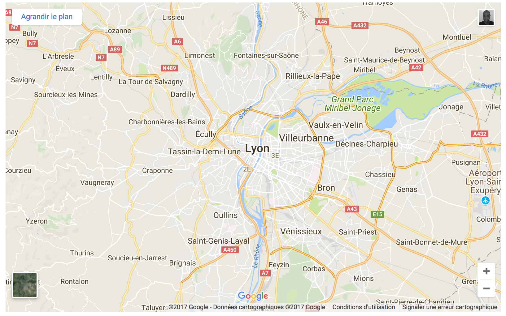

# Hugo-Shortcodes
Those are shortcodes I created for [Hugo](https://gohugo.io/).

### Install
Inside your Hugo project create a `layouts` directory if it does not exist and clone:
```
$ git clone https://github.com/nayed/hugo-shortcodes.git layouts/shortcodes
```

### Included:

#### Google Maps
In your `config.toml` file add in the Params section your Google Maps Embed API key:
```toml
[Params]
googleMapsEmbedAPIKey="YOUR_API_KEY"
```

You are now ready to embed in your article as:


Will ouput:


